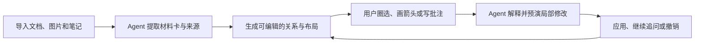
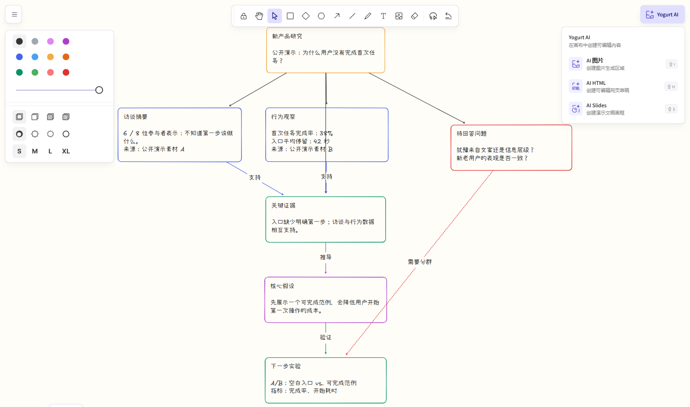
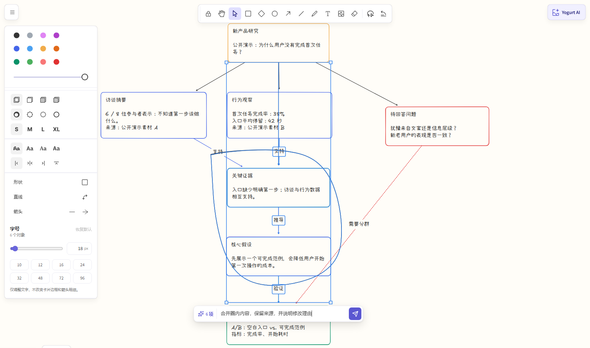
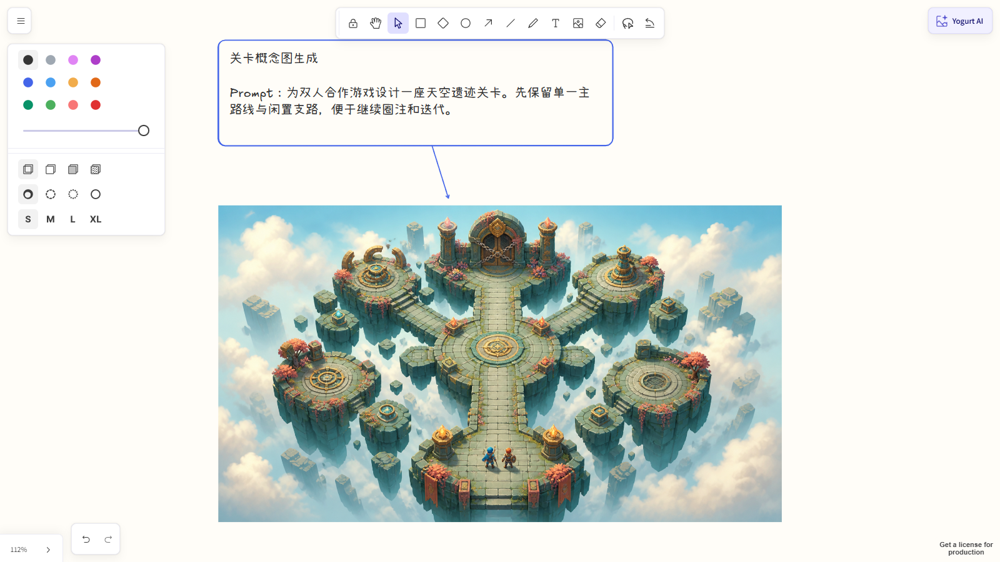
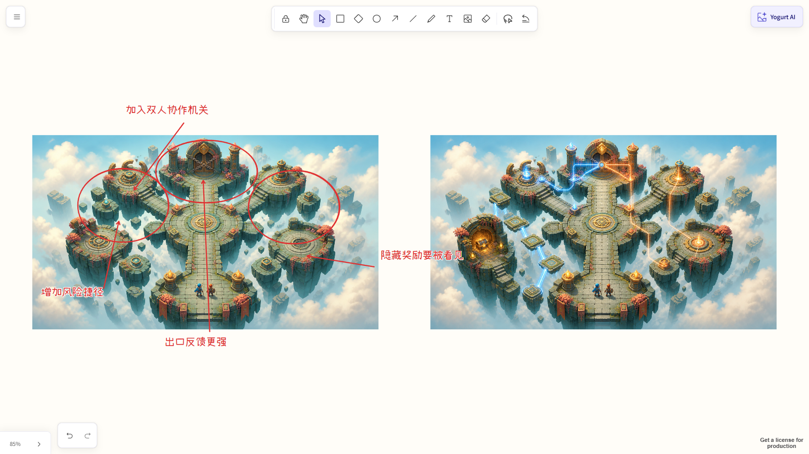
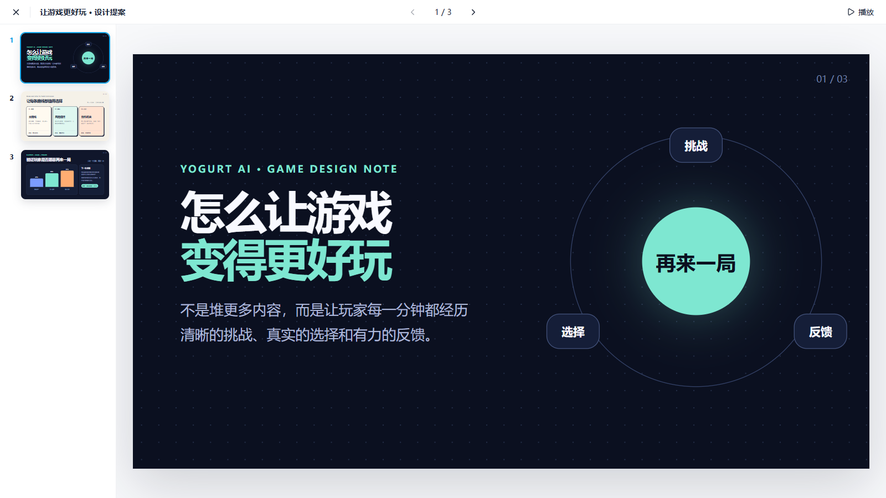
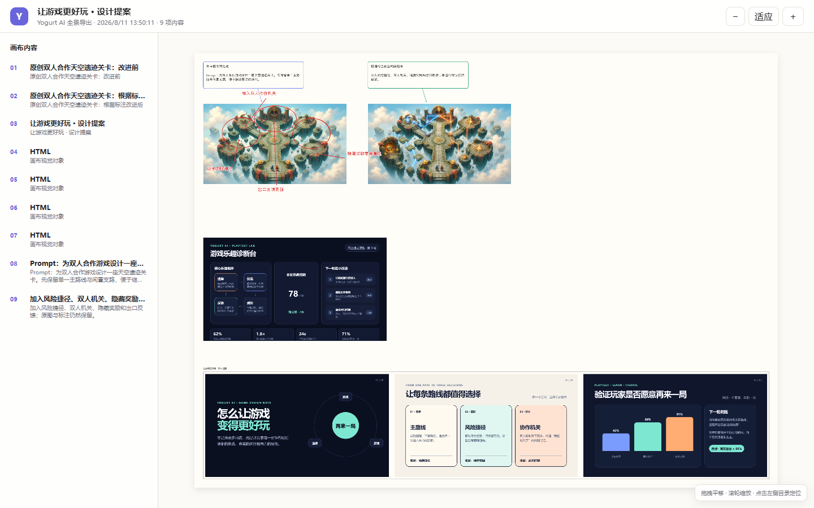
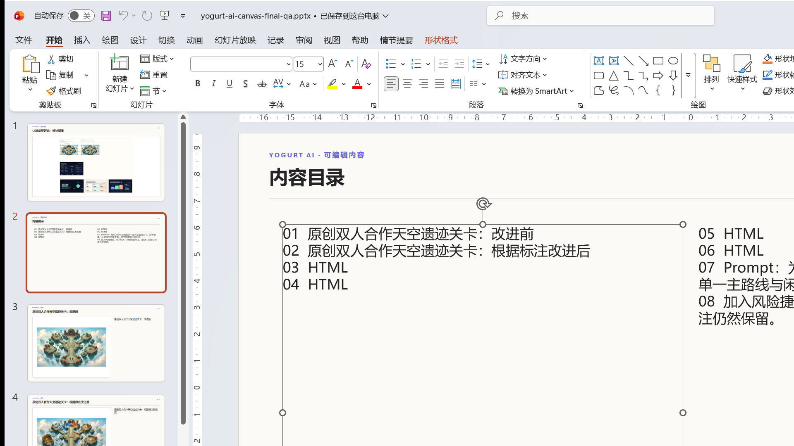

# Yogurt AI

<p align="center">
  
</p>

<p align="center"><strong>把文档、知识、图片和手绘批注，变成一个可持续生长、可圈选修改、可解释与可撤销的非线性思考画布。</strong></p>

<p align="center">
  <a href="README.en.md">English</a> ·
  <a href="#安装">安装</a> ·
  <a href="#三分钟上手">三分钟上手</a> ·
  <a href="#开源参考与致谢">许可与参考</a>
</p>

Yogurt AI 基于开源项目 Cowart 和 tldraw，把用户提供的文档、知识、图片与画布批注组织为可编辑的材料卡、观点、证据、问题和关系。Agent 不会直接重写整张画布：复杂修改会先预演，再以原子操作写入相关区域，并保留解释与安全撤销能力。

<p align="center">
  
</p>
<p align="center"><sub>真实产品截图：把零散材料整理成可以继续拖拽、连线、补充和追问的结构图。演示画布使用完全虚构的公开示例数据，不包含任何用户材料。</sub></p>

## 它适合做什么

| 场景 | 你提供 | Yogurt AI 输出 |
| --- | --- | --- |
| 文档全景梳理 | PRD、研究资料、笔记、图片 | 带来源的材料卡、观点、证据、问题和关系图 |
| 非线性思考 | 一个主题或尚未理清的想法 | 可持续扩展的分支、聚类、对比和推理路径 |
| 圈选局部修改 | 圈线、箭头、划掉、分组、文字批注与自然语言要求 | 只作用于相关区域的修改、解释和 operation ID |
| 视觉内容生成 | Prompt、参考图和画布上下文 | 可预览的 AI 图片、单文件 HTML 和 Slides |
| 画布整合导出 | 当前页面的全部可见对象 | 独立 HTML 全景或可继续编辑的 PowerPoint |

> Yogurt AI 的核心不是“一次生成整张图”，而是让材料、推理和视觉内容在同一个可编辑工作区里逐步长出来。

## 工作方式



## Excalidraw 风格工作区

工具栏、颜色、描边、字体、快捷键和手绘视觉语言参考 Excalidraw；`Yogurt AI` 菜单继续提供图片、HTML 和 Slides 生成入口。

<p align="center">
  
</p>
<p align="center"><sub>真实产品截图：同一份可编辑演示画布中打开 Yogurt AI 菜单。</sub></p>

## 安装

### 从公开 Fork 安装

> 产品对外名称已改为 Yogurt AI。为兼容现有安装和画布数据，GitHub 仓库、插件 ID、MCP 工具名与 `COWART_*` 环境变量暂时保留原技术标识。

```bash
git clone https://github.com/suud003/Cowart.git
cd Cowart
npm install
npm run build
codex plugin marketplace add <Cowart-绝对路径>
codex plugin add cowart-thinking-canvas@cowart-thinking-github
```

安装或重新安装后，请开启一个新的 Codex 任务，让 Skill 和 MCP 工具完整加载。

### 让 Codex 自动安装

把下面这段发给 Codex：

```text
请从我提供的 Yogurt AI 解压目录安装本地 Codex 插件。
先在插件根目录运行 npm install 和 npm run build，再运行
codex plugin marketplace add <解压后的-cowart-thinking-canvas-绝对路径>，
再运行 codex plugin add cowart-thinking-canvas@cowart-thinking-github，
并用 codex plugin list 确认插件已启用。安装完成后提醒我开启一个新任务，
以便加载新的 Skill 和 MCP 工具。
```

### 手动安装

先在解压后的插件根目录安装依赖，再把该目录注册为 Codex marketplace：

```bash
npm install
npm run build
codex plugin marketplace add <absolute-path-to-cowart-thinking-canvas>
```

再从这个 marketplace 安装并检查插件：

```bash
codex plugin add cowart-thinking-canvas@cowart-thinking-github
codex plugin list
```

如果 `cowart-thinking-github` 已经指向当前解压目录，可以跳过第一条命令。安装或重新安装后请开启一个新的 Codex 任务，让 Skill 和 MCP 工具完整加载。

## 三分钟上手

### 1. 打开画布

安装插件并开启一个新的 Codex 任务后，直接说：

```text
打开这个项目的 Yogurt AI 画布。
```

Yogurt AI 会通过兼容工具 `render_cowart_canvas_widget` 打开原生画布，不需要手动启动网页服务。画布数据保存在当前项目的 `canvas/pages/<page-id>/`，不会写入插件仓库。

### 2. 把材料交给 Agent

把文档、图片或笔记放进当前项目，然后说：

```text
把 docs/research 目录里的材料导入 Yogurt AI。
保留文件路径和原文摘录，把“来源内容”和“你的推断”明确区分开。
```

Agent 会把材料变成带来源信息的卡片。项目外部文件只有在你明确允许时，才会复制到 `canvas/materials/`。

### 3. 让结构长出来

```text
围绕“用户为什么会放弃这个流程”整理一张全景图：
先列证据和问题，再补充假设与洞察；用关系线表达因果、支持和冲突。
不要改写原始材料卡。
```

复杂操作会先针对当前 revision 预演；确认画布没有被其他操作改动后，再原子应用同一批卡片、关系与布局修改。

### 4. 圈选并继续修改

点击顶部的 `AI 圈选`，手绘一个闭合区域。Yogurt AI 会选中圈内对象，并把圈线、箭头、划掉、分组、文字批注和选区截图一起交给 Agent。

<p align="center">
  
</p>
<p align="center"><sub>真实产品截图：圈选以后可以直接说“合并圈内内容”“按批注重排”“解释这部分逻辑”或“只修改圈内内容”。</sub></p>

```text
把我圈出的两张卡合并成一个结论卡，保留两条来源；
重新整理圈内关系，但不要移动圈外内容。完成后解释你的修改。
```

Agent 会返回它对批注的理解、修改结果和可撤销的 operation ID。独立 Vite 预览只能保留选区并复制指令；要直接触发 Agent，请使用 Codex 原生 Yogurt AI widget。

### 生成新图

1. 打开 Yogurt AI 画布。
2. 在画布里创建并选中一个 `AI 图片` 框。
3. 在弹出的生成面板里输入 prompt，也可以选择一张或多张参考图，然后点击发送。

Yogurt AI 会把 prompt、参考图和选中 `AI 图片` 框的尺寸信息发送给 Codex。Codex 会按这个框的位置和比例生成图片，然后把 `AI 图片` 框替换成普通图片形状。

下面的原创示例以“怎么让游戏变得更好玩”为主题，先生成一张路线较单一的双人合作天空遗迹关卡，作为后续圈注迭代的原图。



### 根据标注图生成新图

1. 在 Yogurt AI 画布中对图片做标注。
2. 选中被标注的图片，点击 `按标注修改`。
3. Yogurt AI 会导出包含原图、箭头和标注文字的截图，并通过 widget bridge 发送给 Codex。

Codex 会读取截图里的标注和箭头，生成去掉标注痕迹的新图，并把结果放在原图旁边。原图和标注不会被删除或移动。你也可以手动把 Yogurt AI 标注截图发给 Codex，走同样的修订流程。

示例圈出了风险捷径、双人协作机关、隐藏奖励和出口反馈；右侧是 Yogurt AI 根据这些标注生成的干净新版本。



### 生成 AI HTML

1. 在工具栏中创建并选中一个 `AI HTML` 框；新建框默认是 `1024 × 576`（16:9）。
2. 在框下方的生成面板中输入 prompt，也可以选择或粘贴一张或多张参考图。
3. 点击发送后，Codex 会生成完整可运行的单文件 HTML，并把它嵌入选中的 `AI HTML` 框。

生成后的 HTML 会作为画布中的嵌入页面保存在当前 page 的 `assets/` 目录。选中它后可以下载渲染图、直接编辑文本，也可以结合画布标注继续修改 HTML，或根据 HTML 和标注生成图片。

示例生成了一个可编辑的“游戏乐趣诊断台”，把选择、挑战、反馈、成长和下一轮实验放在同一个可视化工作区中。


### 创建和演示 AI Slides

1. 在工具栏中创建一个 `AI Slides`。默认外框是 `1048 × 600`，对应一页 `1024 × 576`（16:9）内容和四周各 `12px` 的留白。
2. 可以把画布中的图片或 HTML 拖入 Slides，也可以复制图片后选中 Slides，再粘贴进去；内容会自动按顺序横向排列。
3. 空 Slides 被选中时会显示生成面板。输入整套演示的描述、按需添加参考图，并选择 3、5、10 页或自定义页数；默认是 5 页。
4. 发送后，Codex 会生成指定数量、视觉与叙事连贯的独立 16:9 HTML 页面，并依次加入当前 Slides。Slides 已有内容时不再显示生成面板。
5. 选中 Slides 后点击 `演示 Slides`，可以通过左侧缩略图预览和切换页面，也可以进入全屏播放。全屏时支持方向键、空格键和点击静态画面翻页；HTML 自身的按钮、链接和表单交互会保留，播放控制栏固定在顶部。

示例把“挑战 × 选择 × 反馈”整理成三页原创游戏设计提案，并在 Yogurt AI 的真实演示器中预览和切换。



### 整合当前画布为 HTML 或 PowerPoint

1. 点击右上角 `Yogurt AI`，选择 `整合为 HTML` 或 `整合为 PowerPoint`。
2. Yogurt AI 会读取当前 page 的全部可见对象，并把 HTML 嵌入、图片、卡片、文字、连线与手绘标注合成完整全景。
3. HTML 是一个不依赖服务器的单文件，支持拖拽、缩放、适应窗口和从内容目录定位；PPTX 包含全景页、目录页和内容详情页。

PPTX 中的标题、目录和详情文字是 PowerPoint 原生文本，可以继续修改；图片、HTML 和复杂手绘内容会以独立视觉对象保真，可在 PowerPoint 中移动、缩放或替换。文件会保存到系统下载目录。

下面使用公开构造的“怎么让游戏变得更好玩”画布展示真实操作。打开 `Yogurt AI` 后，可以直接选择全景 HTML 或 PowerPoint：


HTML 会把当前页面整合为带内容目录的独立全景文件：



PowerPoint 会生成全景、目录和详情页；下图中的目录文字框是被实际选中的原生 PowerPoint 文本，可以继续编辑：



## 数据、来源与撤销

- 画布页面保存在 `canvas/pages/<page-id>/cowart-canvas.json`，图片与 HTML 保存在同一页面的 `assets/` 目录。
- 材料卡分别保存来源路径、原文摘录和 Agent 摘要，避免把事实与推断混在一起。
- 非简单修改遵循“读取上下文 → `dryRun` 预演 → revision 校验 → 原子应用”的流程。
- 每批 Agent 修改都会返回 operation ID；只要后续画布状态兼容，就可以安全撤销，而不会覆盖更新的用户操作。

## 技能

- `cowart-thinking-canvas:cowart-thinking-agent`：依据材料和批注执行“检查上下文 → 区分来源与推断 → 预演 → 局部应用 → 解释与撤销”的工作流。
- `cowart-thinking-canvas:cowart-open-canvas`：打开 Yogurt AI 原生画布 widget。
- `cowart-thinking-canvas:cowart-image-gen`：接收画布内 prompt 和参考图，用生成图片替换选中的 `AI 图片` 框；没有选中框时也可以把生成图插入当前页面。
- `cowart-thinking-canvas:cowart-image-edit`：根据画布提交或用户提供的 Yogurt AI 标注截图生成修订图。

## 本地开发

```bash
npm install
npm run dev
npm run build
```

本地开发时仍可以直接启动 Vite 画布服务，并指定用户项目目录：

```bash
./scripts/start-canvas.sh /path/to/user/project
```

Vite 页面只用于界面开发，不包含 Codex 的 Agent 消息桥。AI 圈选在本地预览中会保留选区并复制指令，同时给出明确提示；要让指令直接触发 Agent，请使用 `render_cowart_canvas_widget` 打开的原生 Yogurt AI 画布。

常用环境变量：

- `COWART_PORT`：本地服务端口，默认 `43217`。
- `COWART_PROJECT_DIR`：画布数据所属的用户项目目录。
- `COWART_CANVAS_DIR`：画布数据目录，默认是 `$COWART_PROJECT_DIR/canvas`。

## 开发者

ZHONG XIN  
zhongxin123456@gmail.com  
https://www.jiqiren.ai

## 开源、参考与致谢

本仓库是 [zhongerxin/Cowart](https://github.com/zhongerxin/Cowart) 的公开 Fork，保留 GitHub Fork 关系和原项目 MIT 许可证。当前发布版本由 [`suud003/Cowart`](https://github.com/suud003/Cowart) 维护。

- [tldraw/tldraw](https://github.com/tldraw/tldraw)：Yogurt AI 的无限画布、图形编辑和交互运行时。当前锁定版本为 `5.1.1`，适用 tldraw 自有许可证，不是 MIT。默认许可仅允许开发环境使用；公开生产部署需要符合其试用、商业或其他替代许可。完整许可证见 [`licenses/TLDRAW-LICENSE.md`](licenses/TLDRAW-LICENSE.md)。
- [excalidraw/excalidraw](https://github.com/excalidraw/excalidraw)：工具布局、手绘视觉语言和交互细节的设计参考。项目没有把 Excalidraw 编辑器作为运行依赖；打包的 Excalifont 文件与霞鹜小赖字形子集清单来自官方 `@excalidraw/excalidraw@0.18.1` 发布包，霞鹜小赖字体文件在运行时从该固定版本的公共 CDN 加载。
- [Excalifont](https://github.com/excalidraw/excalidraw/tree/master/packages/excalidraw/fonts)、[霞鹜小赖](https://github.com/lxgw/kose-font) 与 Assistant：字体文件按 SIL Open Font License 1.1 分发，具体版权信息和完整 OFL 文本见 [`src/assets/fonts/FONT-LICENSES.md`](src/assets/fonts/FONT-LICENSES.md) 与 [`src/assets/fonts/OFL-1.1.txt`](src/assets/fonts/OFL-1.1.txt)。
- [PptxGenJS](https://github.com/gitbrent/PptxGenJS)：在浏览器中生成标准 OOXML `.pptx` 文件，用于画布整合导出；按 MIT License 分发。

根目录 `LICENSE` 只覆盖 Cowart 上游代码与本 Fork 的 MIT 授权部分，不会覆盖或替代第三方依赖的许可证。完整说明见 [`THIRD_PARTY_NOTICES.md`](THIRD_PARTY_NOTICES.md)。
